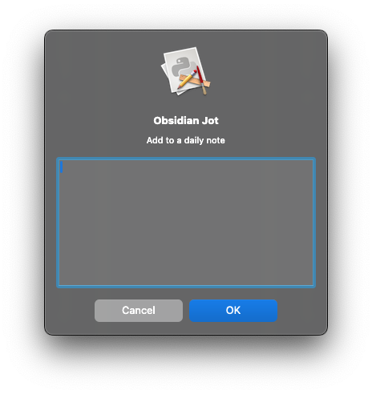

# obsidian-jot
Quickly add a thought or note to a daily note file via a global hotkey. Allows you to avoid switching applications to jot a quick thought down.



## Build
```
pip install -r requirements.txt
```
```
python setup.py py2app
```
